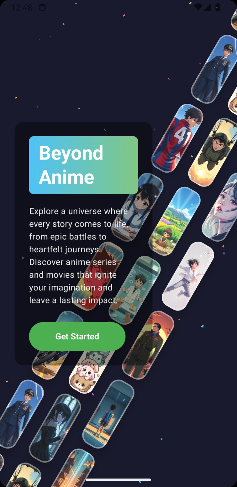
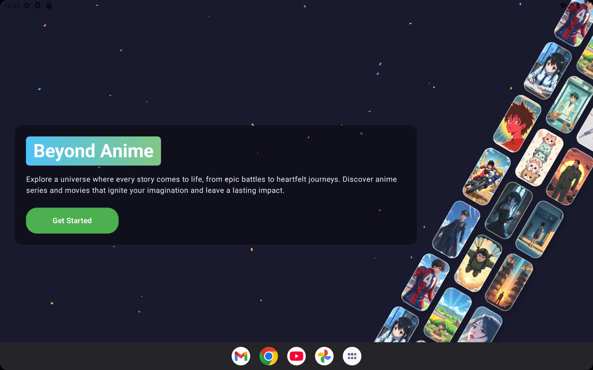

# ConfettiScroll - Beyond Anime

An immersive Android application built with Jetpack Compose that showcases animated confetti effects and scrolling image galleries with an anime theme.

## 📱 Demo

### Screenshots

<div align="center">
  
  
</div>

## 🌟 Features

### Core Components

- **Interactive Confetti Animations**: Multiple confetti systems with customizable particles
- **Scrolling Image Galleries**: Three animated image tracks with independent scroll directions
- **Responsive Design**: Optimized for both tablets and mobile devices
- **Glass Morphism UI**: Modern translucent design elements
- **Infinite Scrolling**: Seamless looping animations for both confetti and images

## 🏗️ Architecture

### Project Structure

```
app/src/main/java/com/gd/confettiscroll/
├── MainActivity.kt           # Entry point activity
├── BeyondAnimeScreen.kt      # Main UI screen with anime theme
├── InfiniteConfetty.kt      # Confetti animation system
└── ui/theme/               # UI theming components
    ├── Color.kt
    ├── Theme.kt
    └── Type.kt
```

### Core Logic

#### 1. BeyondAnimeScreen.kt (`BeyondAnimeScreen`)

The main screen component that orchestrates the entire UI:

- **Background Management**: Dark gradient background (`Color(0xFF1A1A2E)`)
- **Component Composition**: Layers confetti, image tracks, and main content
- **Responsive Layout**: Adapts spacing and sizing based on screen dimensions

**Key Functions:**
- `BeyondAnimeScreen()`: Main composable that assembles all UI components
- `ScrollingImageTracks()`: Manages three independent image tracks with rotation
- `ScrollingImageTrack()`: Individual track with seamless infinite scrolling
- `AnimeImageCard()`: Glass morphism image cards with overlay effects
- `MainContent()`: Hero section with title, description, and CTA button

#### 2. InfiniteConfetty.kt (Confetti Animation System)

Implements sophisticated confetti system:

**Confetti (`InfiniteConfetti`)**:
- Customizable particle count and colors
- Physics-based fall simulation with rotation
- Continuous looping animation

#### 3. Animation Systems

**Infinite Transition Management**:
```kotlin
val infiniteTransition = rememberInfiniteTransition(label = "confetti")
val animationProgress by infiniteTransition.animateFloat(
    initialValue = 0f,
    targetValue = 1f,
    animationSpec = infiniteRepeatable(
        animation = tween(durationMillis, easing = LinearEasing),
        repeatMode = RepeatMode.Restart
    )
)
```

**Seamless Scrolling Algorithm**:
- Calculates visible items needed for continuous loop
- Implements position wrapping for infinite scroll effect
- Optimizes rendering by only drawing visible particles/images

#### 4. Performance Optimizations

- **Lazy Rendering**: Only renders particles/images within screen bounds
- **Memory Management**: Reuses particle objects with data classes
- **Efficient Canvas Drawing**: Uses `drawContext.canvas` operations for transformations
- **Responsive Calculations**: Caches screen dimensions and density values

## 🔧 Technical Implementation

### Dependencies

```kotlin
implementation(libs.androidx.compose.bom)       // Compose BOM
implementation(libs.androidx.ui)                // Core Compose UI
implementation(libs.androidx.material3)         // Material 3 components
implementation(libs.coil.compose)              // Image loading
```

### Key Technologies

- **Jetpack Compose**: Modern declarative UI framework
- **Kotlin**: Primary programming language
- **Canvas API**: Custom drawing for confetti particles
- **Coil**: Asynchronous image loading
- **Material 3**: Design system components

### Build Configuration

- **Target SDK**: 35 (Android 15)
- **Min SDK**: 24 (Android 7.0)
- **Kotlin Version**: 2.1.21
- **Compose BOM**: 2025.07.00

## 🎨 UI/UX Features

### Design Elements

- **Color Palette**: 
  - Primary: Blue tones (`0xFF4FC3F7`)
  - Secondary: Green accents (`0xFF81C784`)
  - Background: Dark navy (`0xFF1A1A2E`)

- **Visual Effects**:
  - Radial gradients for depth
  - Glass morphism with transparency layers
  - Rotation transformations (30° tilt on image tracks)
  - Smooth transitions and animations

### Responsive Design

```kotlin
val isTablet = screenWidth > 600.dp
val horizontalPadding = if (isTablet) 32.dp else 24.dp
val titleFontSize = if (isTablet) 40.sp else 32.sp
```

### Accessibility

- Semantic content descriptions for images
- Scalable font sizes
- High contrast color schemes
- Touch target optimization

## 🚀 Getting Started

### Prerequisites

- Android Studio Hedgehog | 2023.1.1 or newer
- Android SDK 35
- Kotlin 2.1.21

### Installation

1. Clone the repository:
```bash
git clone https://github.com/JediTheFighter/confettiscroll.git
cd confettiscroll
```

2. Open in Android Studio
3. Sync project with Gradle files
4. Run on device or emulator

## 📱 App Features

### Main Screen Components

1. **Hero Section**: "Beyond Anime" branding with call-to-action
2. **Confetti Background**: Animated particles in various colors
3. **Image Galleries**: Three scrolling tracks with anime-themed content
4. **Glass Cards**: Translucent image containers with overlay effects

### Animation Details

- **Confetti**: 60 particles with independent physics
- **Image Tracks**: Bidirectional scrolling (up/down)
- **Rotation**: 30° tilted perspective for visual depth
- **Speed Variation**: Different scroll speeds for dynamic effect


**Built with ❤️ using Jetpack Compose and Modern Android Development practices**